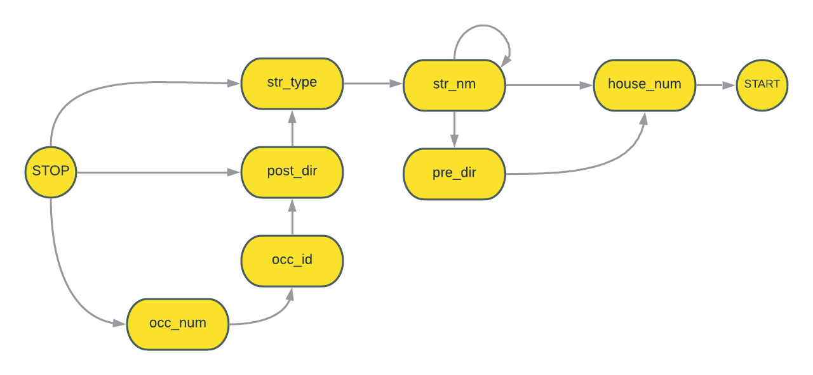

# AddressParser

AddressParser is a Python library to parse Street Addresses into components and standardize them.

## Usage

```python
from address_parser.address import Address

addr = Address("763 West Ketch Harbour Drive")

addr.standardized_address
# returns "763 W KETCH HARBOUR DR"

addr.components
# returns {'str_type': 'DRIVE', 'str_nm': 'KETCH HARBOUR', 'pre_dir': 'WEST', 'house_num': '763'}
```

## Transitions



## License
[MIT](https://choosealicense.com/licenses/mit/)