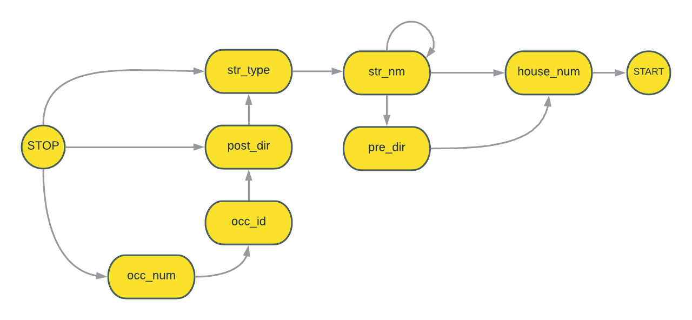

# AddressParser

AddressParser is a Python library to parse Street Addresses into address components using [Finite State Machines (FSM)](https://en.wikipedia.org/wiki/Finite-state_machine "Finite-state machine - Wikipedia").

## Address Components

### Example-1  

`763 W KETCH HARBOUR DRIVE`

| Token           | Address Component |
| --------------- | ----------------- |
| `763`           | House Number      |
| `W`             | Pre-Direction     |
| `KETCH HARBOUR` | Street Name       |
| `DRIVE`         | Street Type       |

### Example-2  

`629 RIVER ST EAST`

| Token    | Address Component |
| -------- | ----------------- |
| `629`    | House Number      |
| `RIVER`  | Street Name       |
| `STREET` | Street Type       |
| `EAST`   | Post-Direction    |

### Example-3  

`7515 GREYSTONE STREET SUITE #2`

| Token       | Address Component    |
| ----------- | -------------------- |
| `7515`      | House Number         |
| `GREYSTONE` | Street Name          |
| `STREET`    | Street Type          |
| `SUITE`     | Occupancy Identifier |
| `#2`        | Occupancy Number     |

## Transitions

| Tag         | Address Component    |
| ----------- | -------------------- |
| `house_num` | House Number         |
| `pre_dir`   | Pre-Direction        |
| `str_nm`    | Street Name          |
| `str_type`  | Street Type          |
| `post_dir`  | Post-Direction       |
| `occ_id`    | Occupancy Identifier |
| `occ_num`   | Occupancy Number     |



## Usage

```python
from address_parser.address import Address

addr = Address("763 West Ketch Harbour Drive")

addr.standardized_address
# returns "763 W KETCH HARBOUR DR"

addr.components
# returns {'str_type': 'DRIVE', 'str_nm': 'KETCH HARBOUR', 'pre_dir': 'WEST', 'house_num': '763'}
```

## License

[MIT](https://choosealicense.com/licenses/mit/)
